# LPR(Vehicle License Plate Recognition)

## 前言

#### 这是一个车牌识别的实例

我的平台是vs2017和opencv3.4

opencv下载链接[点这里][]

[点这里]:https://opencv.org/releases.html

~~写这个是因为实验课布置了一个车牌识别的作业，
但是网上车牌识别的教程都很复杂，也没有太实际。
对于完全没有接触过的人，完全是一头雾水。
所以我在摸索了一个星期后，终于把这个车牌识别了出来，
希望给新手一个指导，怎么一步步地实现一个简单的车牌识别。
(暂时写个大概，有时间后继续完善！觉得有用的话可以给我一个star)~~
***
2018.7.13  
好久都没有来更新，为自己的懒惰感到深深的自责。这次来更新一下说明吧！
***
2020.9.3
这里只用了最简单基于像素点的模板匹配，只做示例。你可以使用一些开源OCR库，或者训练你自己的神经网络去识别字符。
这篇文章的主要目的是介绍传统基于图像的车牌识别的基本流程。其中每个步骤你都可以去找更加行之有效的方法。
顺便介绍一下我的[博客](https://zhanghuan95.github.io/)，里面另一篇关于脑机接口OpenBCI的文章，也很有趣。 
***

>任务:识别下图中的车牌
>
>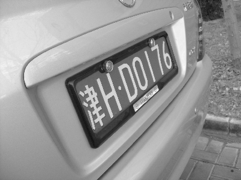

	要实现车牌识别，一共分为两大步。
	第一，车牌定位，就是在图片中确定出车牌的位置；
	第二，字符识别，将提取出来的字符图片进行识别。

## 正文

#### 一、车牌定位

##### 1. 高斯滤波
为什么要高斯滤波呢？原因很简单，因为要平滑图像，去除噪声点。

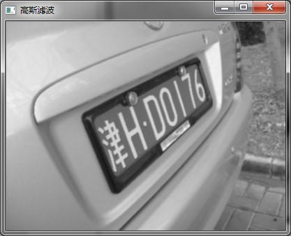
##### 2. sobel边缘提取
至于什么是sobel呢？
我先引用百度的一句话吧：
>Sobel算子是像素图像边缘检测中最重要的算子之一，在技术上，它是一个离散的一阶差分算子，用来计算图像亮度函数的一阶梯度之近似值。在图像的任何一点使用此算子，将会产生该点对应的梯度矢量或是其法矢量。

那我们用sobel算子干嘛呢？我们的目标是定位车牌，因为车牌的周围轮廓分明，使用sobel可以清晰的提取边缘，效果如图所示：  
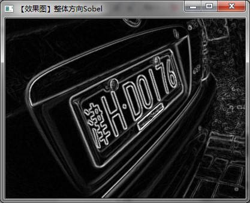
##### 3.二值化图像
这时我们就可以看到车牌成为了图像中亮度最大的区域，所以我们这次再来进行二值化，只保留高于一定阈值的点，效果图如下：

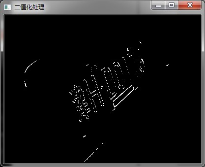
##### 4.闭运算
图像中的这些点我们怎么利用呢？这时我们需要将这些点所在的区域连通起来，所以会用到闭运算。  
什么是闭运算呢？
>在数学形态学中，闭运算被定义为先膨胀后腐蚀。

[先点这里了解腐蚀和膨胀](https://blog.csdn.net/keith_bb/article/details/54572165)

[再点这里了解开运算、闭运算等](https://blog.csdn.net/keith_bb/article/details/54578186?locationNum=6&fps=1)

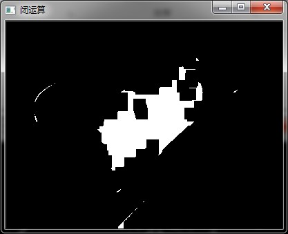
##### 5.去除小区域
了解上面的之后，相信你也知道这里该怎么做啦！

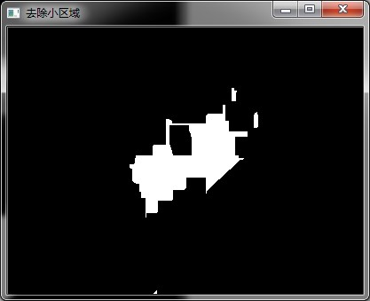
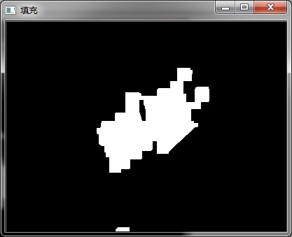
##### 6.提取轮廓
我们在上面已经找到了车牌所在区域，现在我们需要找到车牌的边界点。  
我们有这一堆点集，我们可以迭代寻找出最左边且靠上的点之类的。  
因为我们下一步要做仿射变换，需要三个边界点，所以我们找出如图所示的三个点就行了。

蓝色框可以点下面了解一下，后面会很有用。  
[绘制最小外接矩形](https://blog.csdn.net/dcrmg/article/details/52260699)

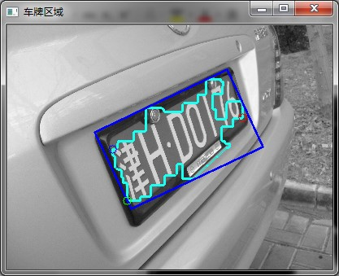
##### 7.仿射变换
原理还是看博客吧，仿射变换能做到对图像旋转，平移和缩放。  
这里根据提取到的点，再对高斯滤波后的图进行仿射变换，只保留车牌部分。

[点一下，玩一年](http://www.opencv.org.cn/opencvdoc/2.3.2/html/doc/tutorials/imgproc/imgtrans/warp_affine/warp_affine.html)

[深入版](https://www.cnblogs.com/bnuvincent/p/6691189.html)

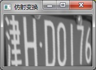

#### 二、字符识别

##### 1.提取字符轮廓
这里先对图像二值化，再寻找最小外接矩形。  
当然汉字可不是很简单，因为有很多独立的笔画，所以还需要在容器中移除小于一定面积的矩形。  
这样一些点啊，就不会在我们需要识别的对象中。

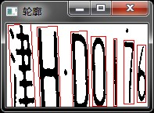

##### 2.识别字符
当时做这个时间因素，采用了最简单也是很有效的一种方法，对每个字符变换到标准大小，和模板点与点之间逐个计算，最后输出与之匹配度最高的字符。
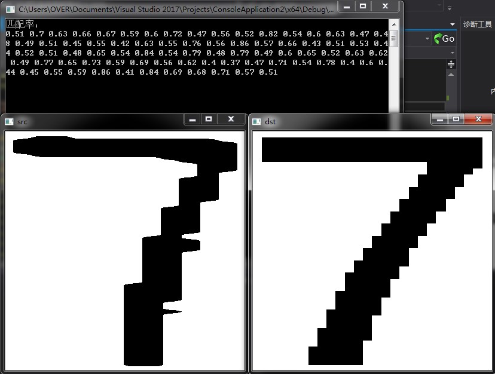

输出结果如下：  
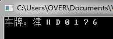
